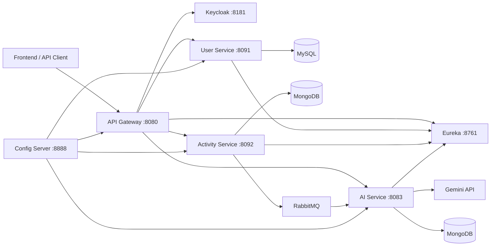

# AI-Powered Fitness Microservices

A full-stack-ready Spring Boot microservices backend for tracking workouts and generating AI fitness recommendations with Google Gemini.

Live frontend demo: `https://nigar-08.github.io/fitness-app/`

The live GitHub Pages build runs in demo mode with sample data. The full
Keycloak, gateway, and microservices flow is designed for local development or a
separate backend deployment.

## Tech Stack

- Java 21, Spring Boot, Spring Cloud
- Spring Cloud Gateway, Eureka Discovery Server, Spring Cloud Config Server
- Keycloak JWT authentication
- Keycloak-managed identity; application services do not store user passwords
- MySQL for users
- MongoDB for activities and AI recommendations
- RabbitMQ for activity events
- RabbitMQ retry and dead-letter handling for failed AI events
- Durable activity outbox state for eventual RabbitMQ publication
- Google Gemini API for recommendation generation
- React + Vite frontend
- Maven and Docker Compose

## Architecture



## Services

| Service | Port | Purpose |
| --- | ---: | --- |
| Eureka | 8761 | Service discovery |
| Config Server | 8888 | Centralized native config |
| Gateway | 8080 | JWT-secured API entry point |
| User Service | 8091 | User registration, profile, validation |
| Activity Service | 8092 | Activity tracking and event publishing |
| AI Service | 8083 | Gemini recommendation generation |
| Frontend | 5173 | React dashboard and activity client |

MySQL is exposed on host port `3307` to avoid conflicts with a local MySQL server that may already be using `3306`.

## Quick Start

1. Copy environment values:

```bash
cp .env.example .env
```

2. Update `GEMINI_API_KEY` in `.env`.

3. Start local infrastructure:

```bash
docker compose --env-file .env up -d
```

4. Create a Keycloak realm named `fitness-oauth2`, a public client named `fitness-frontend`, and a demo user such as `testuser`.

Keycloak client settings for the React frontend:

- Client authentication: `Off`
- Standard flow: `On`
- Valid redirect URIs: `http://localhost:5173/*` and `http://localhost:5174/*`
- Valid post logout redirect URIs: `http://localhost:5173/*` and `http://localhost:5174/*`
- Web origins: `http://localhost:5173` and `http://localhost:5174`

The default JWK URL is:

```text
http://localhost:8181/realms/fitness-oauth2/protocol/openid-connect/certs
```

5. Start services in this order:

```bash
cd eureka && ./mvnw spring-boot:run
cd configserver && ./mvnw spring-boot:run
cd userservice && ./mvnw spring-boot:run
cd activityservice && ./mvnw spring-boot:run
cd aiservice && ./mvnw spring-boot:run
cd gateway && ./mvnw spring-boot:run
```

6. Start the frontend:

```bash
cd frontend && npm install && npm run dev
```

Then open `http://localhost:5173`. If Vite says that port is busy and moves to `5174`, use `http://localhost:5174`.

## Full Docker Deployment

For a real live deployment, use the production compose file on a server or VM
that has Docker installed.

1. Copy the production env file:

```bash
cp .env.prod.example .env.prod
```

2. Edit `.env.prod`:

```text
PUBLIC_APP_URL=http://your-server-ip-or-domain
PUBLIC_KEYCLOAK_URL=http://your-server-ip-or-domain:8181
APP_CORS_ALLOWED_ORIGINS=http://your-server-ip-or-domain
MYSQL_PASSWORD=your-strong-password
KEYCLOAK_ADMIN_PASSWORD=your-strong-password
GEMINI_API_KEY=your-gemini-api-key
```

3. Start the full stack:

```bash
docker compose -f docker-compose.prod.yml --env-file .env.prod up -d --build
```

4. Open the app:

```text
http://your-server-ip-or-domain
```

The production compose stack runs:

- Frontend on port `80`
- Keycloak on port `8181`
- Gateway behind the frontend nginx proxy at `/api`
- Eureka, Config Server, User Service, Activity Service, and AI Service inside the Docker network
- MySQL, MongoDB, RabbitMQ, and Keycloak persistent volumes

The Keycloak realm import creates:

```text
Realm: fitness-oauth2
Client: fitness-frontend
Demo user: testuser / password123
```

Keycloak imports the realm only when its data volume is new. If you need to
re-import from scratch, stop the stack and remove the `keycloak-data` volume.

## API Routes Through Gateway

The frontend uses the normal Keycloak redirect login flow. Users click Login, sign in on the Keycloak page, and return to React with a token. The app refreshes tokens automatically while the refresh session is valid.

- `GET /api/users/{userId}`
- `POST /api/users/register`
- `GET /api/users/{userId}/validate`
- `POST /api/activities`
- `GET /api/activities`
- `GET /api/activities/{activityId}`
- `GET /api/recommendations/user/{userId}`
- `GET /api/recommendations/activity/{activityId}`

## Demo Flow

1. Authenticate with Keycloak.
2. Gateway syncs the Keycloak user into User Service.
3. Create an activity with `POST /api/activities`.
4. Activity Service saves it with pending outbox state; a scheduled publisher sends the RabbitMQ event and records successful publication.
5. AI Service consumes the event, calls Gemini, and saves a recommendation.
6. Fetch the recommendation by user or activity.

Duplicate RabbitMQ deliveries are handled idempotently: AI Service checks for an
existing recommendation by activity ID before calling Gemini. Failed listener
executions are retried with exponential backoff and routed to
`activity.queue.dead` after the configured attempts are exhausted.

## Reliability and Validation

- Activity requests use Bean Validation for required fields and positive numeric values.
- Activity Service returns structured API errors for invalid users, missing activities, and validation failures.
- RabbitMQ consumers retry transient failures and route exhausted messages to a dead-letter queue.
- Activity records retain pending publication state, so a temporary RabbitMQ outage does not silently lose the AI event.
- Recommendation generation is idempotent by activity ID, preventing duplicate Gemini calls and records.
- MongoDB indexes support activity lookup by user and enforce one recommendation per activity.
- Gemini calls use a bounded timeout, validate response structure, and fall back safely when the provider fails or returns malformed content.
- Unit tests cover activity validation/publishing and duplicate event handling.

## Continuous Integration

GitHub Actions runs the complete Maven test suite and a clean frontend production build for every pull request and every push to `main`.

## Notes

- Secrets are read from environment variables through Config Server. Do not commit `.env`.
- RabbitMQ management UI runs at `http://localhost:15672` with `guest/guest`.
- Eureka dashboard runs at `http://localhost:8761`.
- Keycloak admin console runs at `http://localhost:8181` with `admin/admin` for local development.
